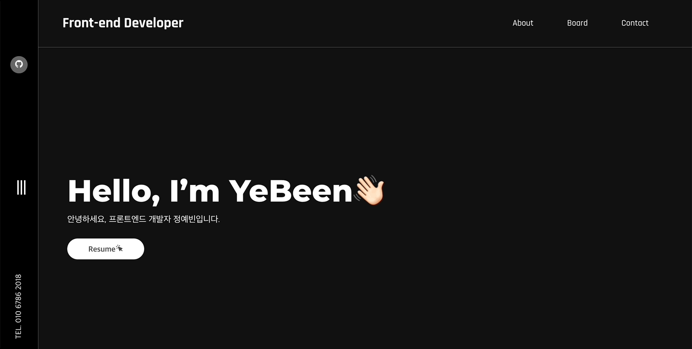
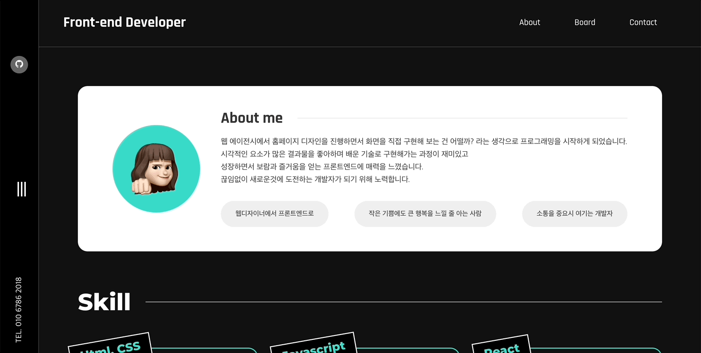
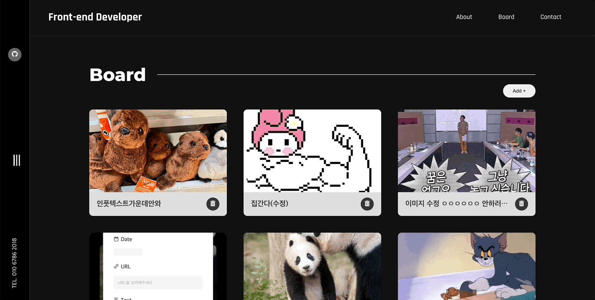

<!--  -->

### 배포 사이트 링크 : <a href="https://monumental-froyo-d44061.netlify.app/" target="_blank">YE BEEN Portfolio</a>

## 📖 프로젝트 소개

---

반응형 홈페이지로 자신을 소개하기 위한 개인 포트폴리오 프로젝트입니다.  
기초 문법과 기초 태그부터 다루고자 초기 세팅부터 모두 직접 구현하였으며,  
다양한 기술 스택의 장단점을 스스로 깨닫고 알아가고자 하여 시작하게 되었습니다.  

현재에도 다양한 상태관리, 라이브러리, 스타일 컴포넌트를 사용해보기 위해 지속적으로 코드를 향상 시키는 목표로 진행하고 있습니다.

 

## 🎯 개발 기간 및 인원

---

- 개발 기간 : 2022/05/09 ~ 현재 진행 중
- 개발 인원 : Frontend 1명(정예빈)

 

## ⚒️ 사용한 기술

---

 

## ☘️ 구현 목표

---

- 메인페이지는 메뉴, 이력서, 소개 등이 간단하게 보여질 수 있도록 구현(햄버거 버튼으로 메뉴 모달창 구현)
- Firebase를 사용하여 Board 메뉴의 데이터가 실시간으로 변경될수 있게 Creat(생성), Read(읽기), Update(갱신), Delete(삭제) 구현
- 지속적으로 코드 향상을 위해 React를 학습하는 것을 목표 구현

 

### Main Page

## 

### About Page

## 

### Board Page

## 
